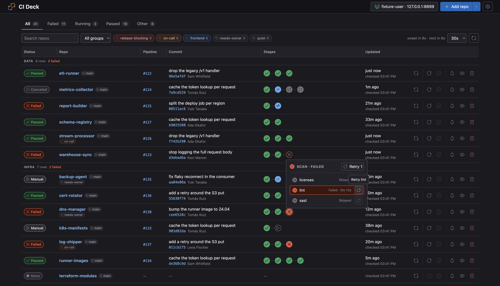

# CI Deck

One page showing the pipeline of every repo you care about, with the GitLab controls you
actually need: expand a stage, read a job log, retry, cancel or start a manual job.



Runs locally on [Bun](https://bun.sh) with **no runtime dependencies** — Bun's own HTTP
server, SQLite and bundler do the work. Talks to GitLab's REST API with your personal
access token.

```bash
bun install
bun run start
# → http://127.0.0.1:8787
```

No configuration files, no environment variables. On first run the board asks for your
GitLab URL and a personal access token, checks them against GitLab, and remembers them in
your operating system's credential store.

Then add repos with **Add repo** — by name, by `group/subgroup/repo` path, or by pasting
any GitLab project URL.

## Requirements

- Bun 1.2.3 or newer — that is where `Bun.serve`'s router landed. Nothing else. Or no Bun
  at all, if you take the standalone build or the container below.
- A GitLab personal access token with the **`api`** scope. `read_api` is not enough,
  because CI Deck retries and cancels jobs.

## Running it without Bun

Every release carries a standalone executable: the board and the Bun runtime in one file,
with nothing to install.

| Platform | Asset |
| --- | --- |
| macOS, Apple silicon | `ci-deck-darwin-arm64` |
| macOS, Intel | `ci-deck-darwin-x64` |
| Linux, x86-64 | `ci-deck-linux-x64` |
| Linux, ARM64 | `ci-deck-linux-arm64` |
| Windows, x86-64 | `ci-deck-windows-x64.exe` |

```bash
curl -fL -o ci-deck https://github.com/ivanbaha/ci-deck/releases/latest/download/ci-deck-darwin-arm64
chmod +x ci-deck
./ci-deck
```

It behaves exactly like the installed command — same flags, same `.env`, same per-user
database, same credential store — minus `--rebuild`, which needs the `web/` sources that a
single file does not carry. `ci-deck --version` says which one you have, since there is no
package manager here to ask.

Nothing checks a file downloaded with `curl` on the way in, so each release also carries a
`SHA256SUMS`, and every executable is attested with build provenance — a signed record of
the workflow and commit that produced it:

```bash
shasum -a 256 -c SHA256SUMS --ignore-missing     # sha256sum -c … on Linux
gh attestation verify ci-deck-darwin-arm64 --repo ivanbaha/ci-deck
```

Two things to know. The files are 60–120 MB, because each one is a whole runtime. And
they are not code-signed, so macOS quarantines anything downloaded with a browser:

```bash
xattr -d com.apple.quarantine ci-deck
```

The Linux builds link against glibc, which covers the mainstream distributions; on Alpine,
install Bun and use the package.

## Running it in Docker

```bash
docker run -p 127.0.0.1:8787:8787 -v ci-deck:/data ivbaha/ci-deck
# → http://localhost:8787
```

Every release publishes `linux/amd64` and `linux/arm64` to both Docker Hub and GHCR, tagged
with the version and — for stable releases — `latest`. One build goes to both, so
`ghcr.io/ivanbaha/ci-deck` is the same image by digest, not merely the same source; reach for
it when Docker Hub's anonymous pull limits get in the way. Either can be checked against the
workflow that built it:

```bash
gh attestation verify oci://ivbaha/ci-deck:latest --repo ivanbaha/ci-deck
```

Or with Compose:

```yaml
services:
  ci-deck:
    image: ivbaha/ci-deck
    ports: ['127.0.0.1:8787:8787']
    volumes: ['ci-deck:/data']
    restart: unless-stopped

volumes:
  ci-deck:
```

Three things are worth understanding about that command.

**It binds `0.0.0.0` inside the container**, because a container's loopback belongs to the
container and a published port would otherwise reach nothing. What keeps the board off your
network is the `127.0.0.1:` in front of the port mapping. Drop that prefix and anything that
can reach your machine can reach the board, with no authentication in front of it.

**The watch list, settings and token live in `/data`** — give it a volume or they go when
the container does.

**A different host port needs one more flag.** The board is reached at whatever name and
port your browser uses, and the server only answers to names it knows about:

```bash
docker run -p 127.0.0.1:9000:8787 -v ci-deck:/data ivbaha/ci-deck \
  --origin http://localhost:9000
```

Everything after the image name is passed to CI Deck, so any flag from the CLI section works
there — including a second `--bind`, which overrides the built-in one.

### Apple's `container`, and other runtimes

It is an ordinary multi-arch OCI image, so anything that runs Linux containers runs it. On
Apple's `container` the same command works, volume and all:

```bash
container run -d -p 127.0.0.1:8787:8787 -v ci-deck:/data ivbaha/ci-deck
```

Reach it through the published port rather than the container's own IP. The IP is not a name
the server answers to, and it is assigned when the container starts, so declaring it with
`--origin` means starting twice to learn it.

The server runs unprivileged wherever it runs. The container starts as root only long enough
to give the data directory to that user, and drops before the server is even executed —
volumes arrive owned by root on some runtimes and by the image's user on others, and this
way neither needs a flag from you.

Windows containers are a different thing entirely — they run the Windows kernel and need a
Windows base image. This image is not one, and does not need to be: Docker Desktop on Windows
runs Linux containers, which is what everyone means by "Docker on Windows".

### The token in a container

Linux has no OS credential store CI Deck can use, so a token entered in the UI sits in the
database in plain text on that volume, and the UI tells you so. To keep it out of the
database entirely, hand it in instead — a token from the environment is used as-is and never
written:

```bash
docker run -p 127.0.0.1:8787:8787 -v ci-deck:/data \
  -e GITLAB_BASE_URL=https://gitlab.com/ -e GITLAB_PAT=glpat-… \
  ivbaha/ci-deck
```

That moves it from the volume into your shell history and `docker inspect` output, which is
a different trade rather than a strictly better one. Compose's `env_file` avoids both.

## Installing it globally

```bash
bun add -g ci-deck   # the `ci-deck` command
bunx ci-deck         # or run it without installing
```

From a checkout, to get the command without publishing anything:

```bash
bun link           # once, from this directory
```

That puts the binary in Bun's global bin directory (`~/.bun/bin`). If it is not on your
`PATH`, either add it or call the binary directly:

```bash
~/.bun/bin/ci-deck            # macOS / Linux
~/.bun/bin/ci-deck.exe        # Windows
```

The database lives in your per-user data directory, so a global install works from any
working directory.

## Using the board

Each row is one repo on one branch — the name and its branch together, its tags under them
— showing the most recent pipeline there: status badge, pipeline number, commit, the stage
bubbles, and when it was last updated and last checked. Rows are grouped into sections by
GitLab namespace, each section counting its rows and its failures. The top bar, the column
header and the current section stay put as you scroll.

Hovering the status badge of a red row lists every job that failed, so the usual question
costs a hover rather than two clicks. Most things on a row have something to add that way:
the whole branch name where it was clipped, a tag's description, what a stage bubble is
hiding, the exact moment behind "23m ago".

**Branches.** A repo can be watched on as many branches as you like — `main` and the
release branch, say — and each is its own row. Adding one looks the repo up as you type
and offers the branches it actually has, so a name that is not there is said before you
commit to it rather than after. Rows for the same repo sit together, and a branch that is
deleted on GitLab is struck through so you can clear it away.

**Stages and jobs.** Click a stage bubble for the jobs in that stage. Each job shows its
status and duration, and carries the one control that applies to it:

| Job status | Control |
| --- | --- |
| running, pending, created | cancel |
| manual | start — confirmed first, since manual jobs often deploy |
| failed, success, canceled, skipped | retry |

The stage header carries the same three, applied to every job in the stage at once —
retry if anything failed, otherwise cancel if anything is still going, otherwise start if
anything is waiting on you.

A bubble shows the worst thing in its stage, which buries the rest, so two things it would
otherwise hide are marked instead: a **dashed halo** for a stage that also holds a manual
job, and an **amber dot** for one where something failed and was allowed to.

Click the job itself to read its log: ANSI colours preserved, progress-bar spam collapsed,
and auto-following while the job is still running. Retry, cancel and copying the raw output
are available there too, and the view keeps up with the job across a retry even though its
id changes.

**Row controls**, on the right of each row:

| Icon | Action |
| --- | --- |
| ⟳ | check this row now, ignoring the sweep and its cache |
| ↺ | retry the pipeline's failed jobs |
| 🚫 | cancel the running pipeline (confirmed) |
| 🔔 | notify, notify silently, or say nothing — click to cycle |
| 👁 / 👁̶ | pause or resume watching |
| 🗑 | remove from the board (confirmed) |

**Watching, paused, removed.** A newly added row is watched. Pausing keeps it on the
board but takes it out of the periodic sweep, so it costs nothing and shows its last known
state; paused rows sink to the bottom of their section and can still be checked with the ⟳
button. Removing takes it off the board entirely.

**Notifications.** When a pipeline the board was watching finishes, it says so — a desktop
notification and a short chime, naming what broke if anything did. Every row has its own
setting, and the global one in Configuration is a ceiling over them: snoozing the board
keeps the notifications and drops the sound, switching it off silences the lot.

Two things are worth knowing. Notifications only happen while a board tab is open, since
there is no background worker; and no browser will play a sound until you have clicked the
page once, so the first click of a session is what arms the chime.

**Filtering.** The tabs count and filter by status (failed, running, passed, other), and
the toolbar under them narrows further: the search box, the group dropdown, and the tag
chips beside them. The search box takes a comma-separated list, which is an OR — `crud,
ledger` shows both — and matches the branch as well as the name. A section disappears when
nothing in it matches. Once a search or a group has narrowed the board, **Save as tag**
turns what is on screen into a tag, so a set worth returning to is one click rather than
sixty.

All four live in the URL, so a reload keeps them, the back button undoes them, and a
filtered board is something you can send to someone. None of them changes what is watched:
the sweep still covers every watched row, and simply visits the ones on screen first.

**Tags.** Repos can carry overlapping, hand-made labels — `lib`, `backs` and `CRUDs` at
once — which filter the board across namespaces. A tag has a name, an optional description
and an optional colour, which its chips wear on every row that carries it: quiet on a row
you are not looking at, solid in the toolbar while it is filtering.

Tags are made and applied under **Configuration → Tags**: the form for one is behind the
**+** beside the list or the pencil on a tag, and ticking a repo saves it immediately, so
one pass sets a tag's whole membership. A repo can also be given a tag as it is added.
Rows themselves are read-only about it — the chips on a row say what it carries and nothing
more. Tags travel in an export, colours and descriptions included.

**Columns.** Drag a divider in the column header to move it, or focus the handle and use
the arrow keys. A divider trades width between the two columns either side of it and
nothing else: widening Stages narrows Updated by exactly as much, until Updated hits its
floor and the divider stops. The board never changes width doing it — the row controls hold
a locked column and the other six divide up what is left — so there is a divider between
each pair and none on the outside edges.

Widths are stored with everything else, as proportions rather than measurements, so a
narrower window redivides the same layout instead of overflowing and the board looks the
same in the next browser you open it in.

**Sweeping.** Everything about the periodic check sits together on the right of the
toolbar, directly above the progress bar it drives: how long the last sweep took and when
the next one is due, the interval — 30s, 60s, 2m, 5m, 10m or 15m, applied the moment you
pick one, default 2 minutes — and a button to check every repo right now.

**The connection.** The button in the top bar is both the status and the way to change it:
it shows who you are connected as and to which host, turns amber when the instance cannot
be reached and red when GitLab rejects the token. Clicking it opens the credentials panel,
where **Test** tries a URL and token against the instance and stores neither — the same
check the save does, without committing the board to the answer. Changing the URL there
switches instances, which is [a watch list of its own](#one-watch-list-per-instance) and
needs that instance's own token; the dialog says so as you type.

**Configuration.** The gear in the top bar opens everything that is set up rather than
done: the connection and where its credentials came from, the sweep interval and the
default branch, whether starting a manual job asks first, the global notification setting,
the theme — light, dark, or whatever the system is using — and the tag manager. All of it
is stored in the database beside the watch list.

## Configuration

Everything can be set in the UI, so the table below is optional. Values are merged **per
value**, most explicit first:

```txt
inline (GITLAB_PAT=… ci-deck)  →  env file  →  what the UI saved
```

| Variable | Description |
| --- | --- |
| `GITLAB_PAT` | personal access token, scope `api` |
| `GITLAB_BASE_URL` | instance root, e.g. `https://gitlab.com/` |
| `CI_DECK_PORT` | HTTP port, default `8787`, overridden by `--port` |
| `CI_DECK_DB` | database path, overridden by `--db` |

The UI shows where each value came from and will not let you edit one the environment is
dictating — otherwise a saved value would be silently ignored. A token supplied through
the environment is never written to the database.

Credentials are always verified against GitLab before being stored, so an accepted form
means a working board. If they are missing or rejected, CI Deck still starts and the UI
opens a setup panel with the reason; it does not exit. See
[`example.env`](./example.env) if you prefer files.

Note that Bun applies `./.env` to the process itself before CI Deck runs. CI Deck reads
the env files again to work out where each value came from, so an explicit `--env` file
still outranks `./.env`, and only variables no file explains count as inline.

## CLI

```txt
ci-deck [options]

--env <path>      env file to read, if present (default: ./.env)
--db <path>       SQLite database (default: per-user data directory)
--port <number>   HTTP port (default: 8787)
--bind <address>  address to listen on (default: 127.0.0.1)
--origin <url>    another origin the board is reached by; repeatable
-h, --help
-v, --version
--rebuild         rebuild the browser bundle before starting
```

`--rebuild` is the one flag the standalone executable does not take: it has no `web/` to
rebuild from.

### Reaching it by another name

The server answers only to names it knows: the three spellings of loopback on its port,
plus the address given to `--bind`. Reach it by any other name — a hostname, or a port
that a container or proxy maps to a different one — and every request is rejected before
it reaches a handler. Name it and it works:

```bash
ci-deck --bind 0.0.0.0 --origin http://ci-deck.example:8787
```

That is the whole story behind the rejection, and it is deliberate: the check is what stops
a page whose DNS was rebound to your loopback from acting as your GitLab session.

## Where state lives

The watch list, settings and a reference to your token are kept in SQLite, in the per-user
data directory:

| OS | Path |
| --- | --- |
| Windows | `%LOCALAPPDATA%\ci-deck\ci-deck.db` |
| macOS | `~/Library/Application Support/ci-deck/ci-deck.db` |
| Linux | `${XDG_DATA_HOME:-~/.local/share}/ci-deck/ci-deck.db` |

Override with `--db ./ci-deck.db` to keep a project-local list, e.g. one per team.

The token itself is not in that file wherever the platform offers something better:

| Platform | Where the token goes |
| --- | --- |
| Windows | DPAPI blob in the database, bound to your user and machine |
| macOS | Keychain item, service `ci-deck` |
| Other | the database in plain text, and the UI says so |

A DPAPI blob only decrypts for the user and machine that wrote it, so a copied database
asks for the token again rather than failing mysteriously.

### One watch list per instance

Each repo records the instance it was resolved against, because GitLab project ids are
per-instance. Point CI Deck at a different host and you get that host's list, not a board
of rows pointing at unrelated projects.

That makes switching hosts a **view swap between separate watch lists, not a migration**:

- A host you have never used starts empty. Nothing was deleted — the rows you had are
  still in the database, filed under the host they belong to.
- Point the board back and they all return, with their branches, tags, paused state and
  notification settings intact.
- Tags belong to an instance too, so the tag bar and Configuration → Tags change with the
  rows.
- A saved token is only ever sent to the host it was saved for, so switching means
  entering that instance's own token. The connection dialog says so rather than silently
  reusing the one you had.
- Nothing is re-resolved across the switch. A project id from one instance means a
  different project on another, which is exactly why the lists are kept apart.

To watch two instances at once, run a second board against its own database
(`--db ./other.db --port 8788`).

## Sharing a watch list

Both live behind the caret next to **Add repo**. **Export** downloads the list; **Import**
opens a dialog you can drop a file onto or browse for, and which offers a template so you
are not guessing at the format.

The dialog reads the file with the same parser the server will use and says what is about
to happen — how many rows it would add, how many are already on the board — before
anything is sent. Import is additive, rows already watched are left alone, and every entry
it skipped is listed with its reason. The paused state and the notification setting travel
with the list. Credentials never do.

An entry is a repo *and* a branch, so the same repo may appear once per branch and an
entry that names one already watched is the only kind of duplicate. A file that says
nothing about a branch means the board's default one, which is what older files always
meant.

Exports record the instance each project id came from. Importing a list from a different
host re-resolves every repo by path instead of trusting ids that would point elsewhere.

Tags travel with the list, including ones nothing carries yet, and including what each one
looks like. A row already on the board is not re-added, but the file's tags are merged onto
it. A tag that already exists keeps the description and colour it has here — the file only
fills in what is blank, since an import adds to a board rather than taking it over.

Hand-written files work too — an array of names is enough, and entries may give just a
`path`. A tag may be named on its own or described in full:

```json
{
  "tags": [
    "backs",
    { "name": "release-blocking", "description": "A red row here stops the release", "color": "#d1392b" }
  ],
  "repos": [
    "my-service",
    { "path": "group/team/other-service", "ref": "main", "tags": ["backs"] },
    { "path": "group/team/other-service", "ref": "develop", "notify": "snooze" }
  ]
}
```

## How polling behaves

- **Serial sweeps.** One repo at a time, ~200ms apart. A sweep never overlaps the next
  one; if it overruns the interval, the following sweep starts right after it. Around 48
  repos take roughly 50s.
- **Two request lanes.** The sweep runs on a serialised lane; everything you trigger — job
  log, retry, cancel, per-row check — runs on a separate lane, so the UI stays responsive
  mid-sweep.
- **Paused rows are skipped**, and are not counted in sweep progress.
- **Filtering reorders the sweep, never shortens it.** The board tells the server which
  rows are on screen and those go first, so narrowing shortens the wait for what you are
  looking at — while a row you filtered out is still checked, and can still tell you it
  broke.
- **Branch existence is checked sparingly.** Only for rows watching something other than
  the default branch, and at most once every five minutes, since the answer changes about
  once in a branch's life.
- **Jobs are cached only when they cannot change.** A finished pipeline costs one request
  per sweep; anything running, pending or manual has its jobs refetched every time,
  because GitLab does not always bump the pipeline's `updated_at` when a single job
  changes state.
- **Retries.** 5 attempts by default with 1/2/4/8/16s backoff, honouring `Retry-After`.
  A 401/403 is never retried: polling stops and the UI shows a banner. Other 4xx are not
  retried either. A repo that keeps failing is marked `Error` and retried next sweep.
- **Project ids are resolved once**, when a repo is added, so sweeps never spend a request
  looking them up.

## Security

Read this before sharing the tool.

- **The server holds your token.** It is never logged, never returned by the API — the UI
  only ever sees a mask like `glpat-…4f2a` plus where it is stored — and never included in
  an export. Anyone who can reach the HTTP port can retry and cancel pipelines as you.
- **Stored, not encrypted-by-magic.** On Windows and macOS the token goes to the OS
  credential store. Everywhere else it sits in the database in plain text and the UI tells
  you so, because encrypting it with a key the app can derive on its own would be
  obfuscation, not protection. The data directory is `0700` where file modes apply.
- **Loopback by default.** It binds to `127.0.0.1`. `--bind` will put it on another
  address — which is what containers need — and says so loudly at startup, because there is
  no authentication: anything that can reach the port can retry and cancel pipelines as
  you. Where you point it is your call; the default is the safe one.
- **Cross-site writes are blocked.** Loopback binding does not stop a web page you have
  open from posting to `127.0.0.1`, so `POST`/`PUT`/`PATCH`/`DELETE` are rejected when the
  request carries a foreign `Origin` or a cross-site `Sec-Fetch-Site`. Header-less clients
  such as `curl` still work.
- **Only names it was told about are answered.** A site whose DNS is rebound to `127.0.0.1`
  looks same-origin to the browser, which sends no `Origin` at all — so every request must
  also be addressed to a name this server answers to: `127.0.0.1`, `localhost` or `[::1]`
  on the right port, plus whatever `--bind` and `--origin` named. Anything else is rejected
  before it reaches a handler, whatever the method. A rebound name never gets on that list,
  because names arrive by being declared, never by resolving here.
- **The saved token only goes to the host it was saved for.** Changing the GitLab URL asks
  for that instance's token instead of forwarding the stored one, so no single request can
  make CI Deck present your PAT somewhere new. Testing a connection is held to the same
  rule as saving one — it is the same check, so it is no way around it.
- **Manual jobs are gated.** Starting one is a deploy in many pipelines, so it asks for
  confirmation first. That can be turned off in Configuration; it is on by default and
  the switch is deliberately not somewhere you meet by accident.
- **Token hygiene.** Use a short expiry and the narrowest scope that works (`api`). Keep
  `.env` out of version control — the shipped `.gitignore` already does that.

## API

| Method | Path | Purpose |
| --- | --- | --- |
| `GET` | `/api/state` | full board snapshot, including credential provenance |
| `GET` | `/api/events` | SSE stream of board updates |
| `PUT` | `/api/credentials` | `{ baseUrl?, token? }` — verified, then stored |
| `POST` | `/api/credentials/test` | `{ baseUrl?, token? }` — verified and nothing else |
| `DELETE` | `/api/credentials` | forget the stored token, keep the list |
| `PUT` | `/api/settings` | `{ pollPeriodSeconds?, defaultRef?, confirmManualRun?, notifications?, theme?, columnWidths? }` |
| `PUT` | `/api/focus` | `{ repos }` — row ids on screen, swept first |
| `GET` | `/api/resolve?repo=` | look a repo up and list its branches |
| `POST` | `/api/tags` | `{ name, description?, color? }` — create |
| `PUT` \| `DELETE` | `/api/tags/:name` | change `{ name?, description?, color? }`, or delete |
| `PUT` | `/api/tags/:name/repos` | `{ repos }` — set a tag's whole membership, by row id |
| `POST` | `/api/sweep` | start a sweep now |
| `POST` | `/api/repos` | `{ repo, ref? }` — name, path or pasted GitLab URL |
| `PUT` | `/api/repos/:id/tags` | `{ tags }` — replace one row's tags |
| `DELETE` | `/api/repos/:id` | remove from the board |
| `PUT` | `/api/repos/:id/watch` | `{ watched }` — pause or resume |
| `PUT` | `/api/repos/:id/notify` | `{ notify }` — `on`, `snooze` or `off` |
| `POST` | `/api/repos/:id/refresh` | check this row now |
| `GET` | `/api/repos/:id/jobs/:jobId/log` | raw job trace |
| `POST` | `/api/repos/:id/jobs/:jobId/retry` \| `/cancel` \| `/play` | job actions |
| `POST` | `/api/repos/:id/stage/:action` | `{ stage }` — the same three, over a whole stage |
| `POST` | `/api/repos/:id/pipeline/retry` \| `/cancel` | pipeline actions |
| `GET` | `/api/export` | download the list, for the instance the board is on |
| `POST` | `/api/import` | add repos from an uploaded list, and apply the settings it carries |

A row is identified by an integer id, not by name: the same repo can be on the board once
per branch, and a name is shared between instances besides.

## Contributing

Layout of the source, the everyday commands, the icon rules and how a release is cut are in
[`CONTRIBUTING.md`](./CONTRIBUTING.md). Notable changes are recorded in
[`CHANGELOG.md`](./CHANGELOG.md).

## Credits

Most icons and the logo are from [SVG Repo](https://www.svgrepo.com) (public domain "Mixer
Tools" set).
All of them are embedded as bare paths in `web/icons.ts` and `web/favicon.svg`, so they
inherit colour and need no network request.

## License

Copyright 2026 Ivan Baha.

Licensed under the Apache License, Version 2.0. See [`LICENSE`](./LICENSE) for the full
text.

Found a security problem? [`SECURITY.md`](./SECURITY.md) says where to send it.
